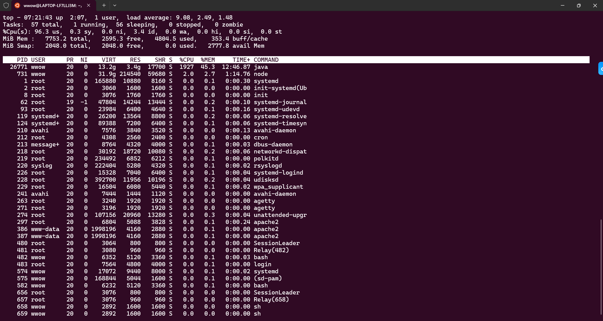

# Assignment 1: Software Performance Measurement
SPECjvm2008 要求使用 Java SE 环境，安装JDK 8
```bash
sudo apt install openjdk-8-jdk
```
`~/.bashrc`中配置java环境
```
export JAVA_HOME=/usr/lib/jvm/java-8-openjdk-amd64
export JRE_HOME=${JAVA_HOME}/jre
export PATH=${JAVA_HOME}/bin:${JRE_HOME}/bin:$PATH
export CLASSPATH=.:${JAVA_HOME}/lib/
```
SPECjvm2008软件包安装位置`~/SPECjvm2008`：
```
java -jar SPECjvm2008_1_01_setup.jar -i console
```
参数配置文件的全部文件（属性文件）在`props/specjvm.properties`(运行参数配置) and `props/specjvm.reporter.properties`(报告生成配置).  
SPECjvm2008 允许把**运行参数（benchmark 的配置参数）和系统信息（用于报告，不影响运行）**分别放在不同的属性文件里管理。
用`-pf runparams.properties`使用不同的配置文件**file1:**`runparams.properties`；**file2:** `sysinfo.properties`


我的`runparams.properties`文件
```
# 运行参数配置示例
# specjvm.benchmarks=
specjvm.runmode=base

# 使用配置系统信息文件(报告信息)
specjvm.additional.properties.file=sysinfo.properties
```
`sysinfo.properties`文件 (specjvm.reporter.properties)
```
###########################################
# Submitter and Environment Information
###########################################

spec.jvm2008.report.run.tester=wwow
spec.jvm2008.report.run.location=YourLocationHere
spec.jvm2008.report.run.license=n/a

###########################################
# OS Information
###########################################

spec.jvm2008.report.os.name=Ubuntu 22.04.5 LTS
spec.jvm2008.report.os.address.bits=64
spec.jvm2008.report.os.available.date=2022-04-21
spec.jvm2008.report.sw.filesystem=ext4

###########################################
# JVM Information
###########################################

spec.jvm2008.report.jvm.name=OpenJDK 64-Bit Server VM
spec.jvm2008.report.jvm.version=1.8.0_452
spec.jvm2008.report.jvm.java.specification=1.8
spec.jvm2008.report.jvm.address.bits=64
spec.jvm2008.report.jvm.command.line=java -jar SPECjvm2008.jar

###########################################
# Hardware Information
###########################################

spec.jvm2008.report.hw.vendor=Intel
spec.jvm2008.report.hw.vendor.url=https://www.intel.com/
spec.jvm2008.report.hw.model=13th Gen Intel Core i9-13900H
spec.jvm2008.report.hw.available=2023-01-01

spec.jvm2008.report.hw.cpu.vendor=Intel
spec.jvm2008.report.hw.cpu.vendor.url=https://www.intel.com/
spec.jvm2008.report.hw.cpu.name=Intel(R) Core(TM) i9-13900H CPU @ 2.60GHz
spec.jvm2008.report.hw.cpu.speed=2600
spec.jvm2008.report.hw.cpu.cache.l1=480KB (Data) + 320KB (Instruction)
spec.jvm2008.report.hw.cpu.cache.l2=12.5MB
spec.jvm2008.report.hw.cpu.cache.other=24MB (L3)

spec.jvm2008.report.hw.logical.cpus=20
spec.jvm2008.report.hw.number.of.cores=10
spec.jvm2008.report.hw.threads.per.core=2
spec.jvm2008.report.hw.number.of.chips=1
spec.jvm2008.report.hw.number.of.cores.per.chip=10
spec.jvm2008.report.hw.threading.enabled=true
spec.jvm2008.report.hw.address.bits=64

spec.jvm2008.report.hw.memory.size=7680
spec.jvm2008.report.hw.memory.details=7.6GB DDR4 (shared with system)
```

以下是运行Debug  

RTFM官方手册[SPECjvm2008 User's Guide](https://www.spec.org/jvm2008/docs/UserGuide.html#WhereToRun)  
**5 Running SPECjvm2008**
```bash
java -Xmx400m -jar SPECjvm2008.jar
```
- Bug 1  
    但是运行到benchmark：`compiler.compiler`的时候报错`java.lang.OutOfMemoryError: Java heap space`  
    原因：400M太少，改成8G：
    ```bash
    java -Xmx8G -jar SPECjvm2008.jar
    ```
- Bug 2  
    `startup.compiler.sunflow`出现堵塞现象  
    解决，参考[堵塞原因](https://www.jianshu.com/p/9924b206bdfe)和[解决办法](https://blog.csdn.net/tylisitonny/article/details/114634878)  
    ```bash
    # 找到堵塞用例涉及的进程PID
    ps -aux|grep sunflow 
    cd /proc/PID/task

    # 在task目录下找到最后一个TID号
    cd TID

    # 显示当前进程正在执行的系统调用
    cat syscall 

    # fd是进程的文件描述符，其中2是标准错误
    cat fd/2
    ```
- Bug 3  
    某种警告刷屏  
    > warning: spec.benchmarks.compiler.SpecFileManager$CachedFileObject@3d93dc1: major version 52 is newer than 51, the highest major version supported by this compiler.   
    > It is recommended that the compiler be upgraded.
    在第005次尝试中，把warning存到`spec-warnings.log`中
    ```bash
    java -Xmx8G -jar SPECjvm2008.jar 2> ./results/spec-warnings.log
    ```
    忽略这个warning也没什么问题，在SPECjvm2008安装目录下运行以下命令，获取运行测试后的结果`./results/SPECjvm2008.008`
    ```bash
    java -Xmx8G -jar SPECjvm2008.jar -pf runparams.properties 2> /dev/null
    ```

## Bonus Points
- **What is the performance metric of SPECjvm2008? Why? What are the units of measurements?**
- **SPECjvm2008性能指标是什么？单位是什么？为什么选择这种方式？**

  SPECjvm2008 User's Guide 1.10
  The ops/m metric is calculated using the time taken for each workload to be run for one operation by a newly started JVM.
  
  SPECjvm2008 Frequently Asked Questions  
  SPECjvm2008 produces these throughput metrics in operations per minute (ops/m):
  - The total base throughput measurement, SPECjvm2008 Base ops/m
    This is the overall throughput result obtained from a full compliant base run. A base run requires that there is no hand tuning of the JVM.
  - The total peak throughput measurement, SPECjvm2008 Peak ops/m
    This is the overall throughput result obtained from a full compliant peak run. A peak run does allow tuning of the JVM and represent the maximum throughput that can be achieved with the system.  
    
  SPECjvm2008 的性能指标是 “operations per minute”（每分钟操作数，简称 ops/m）。这是一个衡量系统在单位时间内能完成多少 Java 工作负载操作的指标。之所以采用这种度量方式，是因为它直接反映了系统在运行 Java 应用时的吞吐能力，也方便不同平台之间的性能比较。
  单位是：ops/m  


- **What factors affect the scores? Why some get higher scores, but others get lower scores?** 
- **哪些因素影响得分？为什么有些分高有些分低？**

  影响 SPECjvm2008 得分（ops/m）的因素主要包括硬件性能、JVM 行为、操作系统调度以及基准测试自身特性。硬件方面，CPU 核心数、主频、缓存和内存带宽决定了系统的并发能力和数据处理效率；JVM 的即时编译（JIT）和垃圾回收（GC）策略会显著影响测试运行期间的性能表现；操作系统层面的线程调度和背景负载也可能干扰基准任务的执行。不同的基准测试对系统资源的依赖程度不同，部分测试如 crypto 和 scimark 可充分并行化，适合多核执行，得分较高；而 startup 或 serial 等测试运行时间短、单线程特性强，得分相对较低。总的来说，得分差异反映了系统与 JVM 对不同类型 Java 工作负载的适配能力和优化程度。


- **Why is warmup required in SPECjvm2008, and does warmup time have any impact on performance test results?**
- **为什么需要预热？预热时间会影响测试结果吗？**

  在 SPECjvm2008 中，预热（warmup）是确保性能测试结果准确性的重要步骤。由于 Java 程序运行在 JVM 上，首次执行时会经历类加载、解释执行、JIT 编译等动态优化过程，这些操作在测试初期会导致性能较低。如果不进行充分预热，测得的吞吐量（ops/m）将受到“冷启动”影响，不能反映系统在稳定状态下的真实性能。因此，SPECjvm2008 在每个基准开始前自动进行一段 warmup 时间，使程序进入稳定的高性能运行阶段。预热时间越充分，JVM 优化越完全，结果越准确、波动越小；相反，预热不足会导致得分偏低甚至不稳定。

- **Did you get close to 100% CPU utilization running SPECjvm2008? Why or why not?**  
- **CPU 利用率是否接近 100%？为什么？**
  

  us + sy = 96.6%，说明系统绝大部分时间都在执行计算任务
  PID 为 26771 的 java 进程占用了 1323.2% CPU → 表明它使用了约 13 个线程或核心并发运行（在多核系统中每个核心是 100%）；

  使用 top 命令实时监测运行 SPECjvm2008 期间的系统状态，结果显示 %Cpu(s) 中 us+sy 高达 96.6%，空闲率仅为 3.4%。Java 进程（PID 26771）占用了约 1323% CPU，说明 JVM 成功创建多个并发线程，充分利用了本机的多核处理器资源，系统处于高负载状态。由此可见 SPECjvm2008 能真实地压满 CPU，是有效的吞吐性能基准测试。

  在实验过程中，SPECjvm2008 总体 CPU 利用率达到了 96.6%，但未完全达到 100%。通过 top 和进程监控分析，发现这是由于部分基准测试线程数量有限或为串行任务，未能完全占用所有核心。同时，JVM 在不同阶段（如 GC、JIT）存在短暂等待，也造成了个别核心在统计期间处于 idle 状态。这表明 SPECjvm2008 的并发能力仍受基准类型和 JVM 行为影响，100% CPU 利用率并非始终可达。


  


