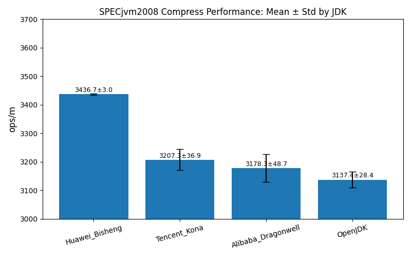
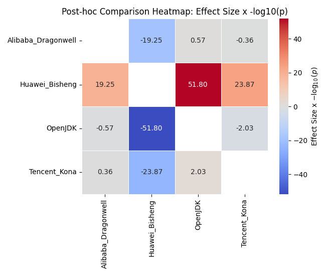

# Assignment 2: Software Performance Evaluation
## 系统校准  
统一设置 CPU 调度模式（governor）
```bash
# 查看所有CPU的调度模式
cat /sys/devices/system/cpu/cpu*/cpufreq/scaling_governor

# 设置为performance模式
echo performance | sudo tee /sys/devices/system/cpu/cpu*/cpufreq/scaling_governor
``` 
统一设置I/O 调度器
```bash
# 查看当前磁盘的I/O调度器（例如sda、nvme0n1）
cat /sys/block/{sda,nvme0n1}/queue/scheduler

# 设置为deadline或none（NVMe建议none）
echo deadline | sudo tee /sys/block/sda/queue/scheduler
echo none | sudo tee /sys/block/nvme0n1/queue/scheduler
```

## 安装JDK 路径`$HOME/22012820/jdks`
设置`JDK_ROOT="$HOME/22012820/jdks"`
- `openjdk 1.8.0_452` 在 `~/.bashrc`中配置
- `Alibaba_Dragonwell_Standard_8.25.24_x64_linux` （dragonwell-8）下载地址[Dragonwell 8](https://dragonwell.oss-cn-shanghai.aliyuncs.com/8.25.24/Alibaba_Dragonwell_Standard_8.25.24_x64_linux.tar.gz)
- `TencentKona8.0.22.b1_jdk_linux-x86_64_8u452` （TencentKona-8）下载地址[TencentKona-8](https://github.com/Tencent/TencentKona-8/releases/download/8.0.22-GA/TencentKona8.0.22.b1_jdk_linux-x86_64_8u452.tar.gz)
- `bisheng-jdk-8u452-b12-linux-x64` （bisheng-8）下载地址[毕昇JDK 8](https://www.hikunpeng.com/developer/devkit/download/jdk)

**Openjdk**
```
openjdk version "1.8.0_452"
OpenJDK Runtime Environment (build 1.8.0_452-8u452-ga~us1-0ubuntu1~22.04-b09)
OpenJDK 64-Bit Server VM (build 25.452-b09, mixed mode)
```

**Dragonwell**
```
openjdk version "1.8.0_452"
OpenJDK Runtime Environment (Alibaba Dragonwell Standard Edition 8.25.24) (build 1.8.0_452-b01)
OpenJDK 64-Bit Server VM (Alibaba Dragonwell Standard Edition 8.25.24) (build 25.452-b01, mixed mode)
```

**Tencent Kona**
```
openjdk version "1.8.0_452"
OpenJDK Runtime Environment (Tencent Kona 8.0.22) (build 1.8.0_452-b1)
OpenJDK 64-Bit Server VM (Tencent Kona 8.0.22) (build 25.452-b1, mixed mode, sharing)
```

**BiSheng**
```
openjdk version "1.8.0_452"
OpenJDK Runtime Environment BiSheng (build 1.8.0_452-b12)
OpenJDK 64-Bit Server VM BiSheng (build 25.452-b12, mixed mode)
```
--------------------------

项目结构
```
Assignment2/
├── A2_README.md
├── props
│   ├── bisheng.properties
│   ├── bisheng.reporter.properties
│   ├── dragonwell.properties
│   ├── dragonwell.reporter.properties
│   ├── openjdk.properties
│   ├── openjdk.reporter.properties
│   ├── tencentkona.properties
│   └── tencentkona.reporter.properties
├── results
│   ├── analyze.py
│   ├── bisheng_results
│   ├── compress_ops_bar.png
│   ├── dragonwell_results
│   ├── openjdk_results
│   └── tencentkona_results
└── src
    └── runspecjvm.sh
```
工作负载选择：用于 CPU 密集型任务的 compress  
`runspecjvm.sh`脚本启动测试，配置每个JDK，对堆大小、垃圾回收参数及其他 JVM 启动参数进行优化

添加测试的环境变量
```bash
export SPECJVM_TEST_HOME=/home/wwow/test_SPECjvm
export SPECJVM2008_HOME=/home/wwow/SPECjvm2008
```


```bash
#!/usr/bin/env bash
BASEDIR="$SPECJVM2008_HOME"
OPENJDK_PROPS_FILE="$SPECJVM_TEST_HOME/Assignment2/props/openjdk.properties"
DRAGONWELL_PROPS_FILE="$SPECJVM_TEST_HOME/Assignment2/props/dragonwell.properties"
TENCENTKONA_PROPS_FILE="$SPECJVM_TEST_HOME/Assignment2/props/tencentkona.properties"
BISHENG_PROPS_FILE="$SPECJVM_TEST_HOME/Assignment2/props/bisheng.properties"

# 定义一个函数，切换 JDK
usejdk() {
  if [ -z "$1" ]; then
    echo "Usage: usejdk <jdk-name>"
    return 1
  fi

  # 目标 JDK 路径
  local target="$JDK_ROOT/$1"
  if [ ! -d "$target" ]; then
    echo "Error: JDK '$1' not found under $JDK_ROOT"
    return 1
  fi

  # 清理 PATH 中旧的 JDK_ROOT 下的条目
  local clean_path
  clean_path=$(echo "$PATH" | tr ':' '\n' \
               | grep -v "^$JDK_ROOT" \
               | paste -sd: -)

  export JAVA_HOME="$target"
  export JRE_HOME="$JAVA_HOME/jre"
  export PATH="$JAVA_HOME/bin:$JRE_HOME/bin:$clean_path"
  export CLASSPATH=".:$JAVA_HOME/lib/"

  echo "Switched to $1:"
  java -version
}
# usejdk dragonwell-8

source ~/.bashrc
java \
  -Xms350g \
  -Xmx350g \
  -XX:NewSize=100g \
  -XX:MaxNewSize=100g \
  -XX:MetaspaceSize=1g \
  -XX:MaxMetaspaceSize=2g \
  -XX:+UseParallelGC \
  -XX:+UseParallelOldGC \
  -XX:ParallelGCThreads=16 \
  -XX:+DisableExplicitGC \
  -XX:+UseAdaptiveSizePolicy \
  -XX:MaxTenuringThreshold=4 \
  -Dspecjvm.home.dir="$BASEDIR" \
  -jar "$BASEDIR/SPECjvm2008.jar" \
  -ikv \
  -pf "$OPENJDK_PROPS_FILE"


usejdk dragonwell-8

java \
  -Xms350g \
  -Xmx350g \
  -XX:NewSize=100g \
  -XX:MaxNewSize=100g \
  -XX:MetaspaceSize=1g \
  -XX:MaxMetaspaceSize=2g \
  -XX:+UseG1GC \
  -XX:ParallelGCThreads=16 \
  -XX:+DisableExplicitGC \
  -XX:+UseAdaptiveSizePolicy \
  -XX:MaxTenuringThreshold=4 \
  -Dspecjvm.home.dir="$BASEDIR" \
  -jar "$BASEDIR/SPECjvm2008.jar" \
  -ikv \
  -pf "$DRAGONWELL_PROPS_FILE"


#
usejdk TencentKona-8
java \
  -Xms350g \
  -Xmx350g \
  -XX:NewSize=100g \
  -XX:MaxNewSize=100g \
  -XX:MetaspaceSize=1g \
  -XX:MaxMetaspaceSize=2g \
  -XX:+UseG1GC \
  -XX:+G1ParallelFullGC \
  -XX:+G1RebuildRemSet \
  -XX:ParallelGCThreads=16 \
  -XX:+DisableExplicitGC \
  -XX:+UseAdaptiveSizePolicy \
  -XX:MaxTenuringThreshold=4 \
  -Dspecjvm.home.dir="$BASEDIR" \
  -jar "$BASEDIR/SPECjvm2008.jar" \
  -ikv \
  -pf "$TENCENTKONA_PROPS_FILE"


#
usejdk bisheng-8
java \
  -Xms350g \
  -Xmx350g \
  -XX:NewSize=100g \
  -XX:MaxNewSize=100g \
  -XX:MetaspaceSize=1g \
  -XX:MaxMetaspaceSize=2g \
  -XX:+UseG1GC \
  -XX:+G1ParallelFullGC \
  -XX:+UseNUMA \
  -XX:+G1Uncommit \
  -XX:ParallelGCThreads=16 \
  -XX:+DisableExplicitGC \
  -XX:+UseAdaptiveSizePolicy \
  -XX:MaxTenuringThreshold=4 \
  -Dspecjvm.home.dir="$BASEDIR" \
  -jar "$BASEDIR/SPECjvm2008.jar" \
  -ikv \
  -pf "$BISHENG_PROPS_FILE"

```

`props/*.properties`文件中都配置迭代次数为5
```
specjvm.miniter=5
specjvm.maxiter=5
```

在Assignment2下运行`./src/runspecjvm.sh`启动测试，测试结果保存在`./results`目录下的`SPECjvm2008.002`

---

`analyze.py`用于画图和分析  
安装相关的包
```
pip install numpy pandas matplotlib seaborn scipy pingouin
```
运行
```
python3 analyze.py SPECjvm2008.002
```
## 原始数据
| JDK                 | Iteration 1 | Iteration 2 | Iteration 3 | Iteration 4 | Iteration 5 |
| ------------------- | ----------- | ----------- | ----------- | ----------- | ----------- |
| Huawei\_Bisheng     | 3434.38     | 3435.37     | 3436.19     | 3435.77     | 3442.02     |
| Alibaba\_Dragonwell | 3247.54     | 3163.97     | 3189.46     | 3178.43     | 3112.11     |
| OpenJDK             | 3158.06     | 3166.34     | 3143.94     | 3096.29     | 3122.56     |
| Tencent\_Kona       | 3214.81     | 3237.75     | 3175.60     | 3245.52     | 3162.69     |

## Central Tendency
* *to summarize overall performance*

| JDK                   | 算数平均数   | 几何平均数       | 中位数   |
|-----------------------|-------------|------------------|---------|
| Huawei_Bisheng        | 3436.746    | 3436.744937      | 3435.77 |
| Alibaba_Dragonwell    | 3178.302    | 3178.003149      | 3178.43 |
| OpenJDK               | 3137.438    | 3137.335178      | 3143.94 |
| Tencent_Kona          | 3207.274    | 3207.104168      | 3214.81 |

直接比较平均数和中位数，可以看出Bisheng，Dragonwell，Kona相比OpenJDK均有性能提升；其中按平均性能从高到低为：Bisheng、Kona、Dragonwell。

## Variability Indices 
* *to gauge consistency*

| JDK                   | 标准差      |
|-----------------------|-------------|
| Huawei_Bisheng        | 3.023579    |
| Alibaba_Dragonwell    | 48.747321   |
| OpenJDK               | 28.360982   |
| Tencent_Kona          | 36.875838   |

从标准差指标来看，Huawei_Bisheng的性能稳定性最优，其次是OpenJDK、Bisheng，而Dragonwell的性能波动相对较明显。

## Statistical Tests 
* *to discern significant differences among groups*

检验基于以下假设：

1. 同一JDK的性能分布是正态的，从而不同JDK的性能差是正态的。
2. 不同JDK之间按迭代轮数可配对。
3. 球形性(Sphericity),即任意两JDK差值的方差相等。

容易验证满足以上所有条件是使用以下所有验证充分条件。先验证假设1,对四种JDK做Shapiro-Wilk正态性检验，结果如下：

| JDK                 | W 值     | p 值    | 正态性判断   |
|---------------------|----------|---------|-------------|
| Huawei_Bisheng      | 0.7611   | 0.0376  | 接近正态分布 |
| Alibaba_Dragonwell  | 0.9729   | 0.8935  | 服从正态分布 |
| OpenJDK             | 0.9445   | 0.6981  | 服从正态分布 |
| Tencent_Kona        | 0.9022   | 0.4222  | 服从正态分布 |

考虑到样本容量太小，设置显著性水平α = 0.01，认为假设1成立，可以进行往下的分析。为考察Bisheng，Dragonwell，Kona平均性能提升的显著程度，以OpenJDK为baseline，分别与三种JDK作配对T检验。这里认为假设2自然成立，进行显著性检验的结果如下。可以认为Bisheng相比OpenJDK有性能上的显著提升，Kona相比OpenJDK有性能上的较显著提升，而Drangonwell相比OpenJDK baseline并未有显著提升。


| JDK 对比                       | t 统计量   | p 值     |
|--------------------------------|------------|----------|
| Huawei_Bisheng 与 OpenJDK      | -22.5775   | 0.000023  |
| Alibaba_Dragonwell 与 OpenJDK  | -1.9716    | 0.119943  |
| Tencent_Kona 与 OpenJDK        | -3.3261    | 0.029212  |

为进一步做更细致的检验，考虑到假设3并非自然成立，对数据做Mauchly球形检验，得到结果：

|指标             |数值        |
|----------------|------------|
| Mauchly's W    | 0.5885    |
| p值            | 0.9245     |

由于p = 0.9245很接近1，可以认为假设3成立。于是可以使用重复测量方差分析(Repeated Measures ANOVA)来进一步检测彼此之间性能差距的显著性。得到结果：

| Source | ddof1 | ddof2 | F          | p-unc     | ng2       | eps       |
|--------|-------|-------|------------|-----------|-----------|-----------|
| JDK    | 3     | 12    | 91.824207  | 1.523528e-08  | 0.93697  | 0.807534  |

p = 1.523528e-08 << 0.01 = α,可以认为各组间性能有显著差异，故进一步使用Holm-Bonferroni校正完成事后检验，结果如下：

| A                    | B                 | p-corr   | Hedges’ g    |
|----------------------|-------------------|----------|--------------|
| Alibaba_Dragonwell   | Huawei_Bisheng    | 0.001419 | -6.759168    |
| Alibaba_Dragonwell   | OpenJDK           | 0.239887 | 0.925539     |
| Alibaba_Dragonwell   | Tencent_Kona      | 0.255944 | -0.605451    |
| Huawei_Bisheng       | OpenJDK           | 0.000137 | 13.404612    |
| Huawei_Bisheng       | Tencent_Kona      | 0.000970 | 7.922170     |
| OpenJDK              | Tencent_Kona      | 0.087636 | -1.917541    |

认为显著性水平α = 0.01，效应量小、中等、大的典型值分别为0.2、0.5、1，由此具体分析每组的结果：

| 对比组                     | 结论与解读                               |
|---------------------------|----------------------------------------|
| Alibaba_Dragonwell vs Huawei_Bisheng  | 差异显著。效应量很大，表明Huawei_Bisheng性能显著优于Dragonwell，且差异具有实际意义。 |
| Alibaba_Dragonwell vs OpenJDK        |  差异不显著。效应量大，表明Dragonwell强于OpenJDK，但统计不显著，实际性能水平相近 |
| Alibaba_Dragonwell vs Tencent_Kona   | 差异不显著。效应量中等，表明Kona略优于Dragonwell，但统计不显著，实际性能水平相近 |
| Huawei_Bisheng vs OpenJDK            |  差异显著。效应量非常大，表明Huawei_Bisheng性能显著大优于OpenJDK，且差异实际非常显著。 |
| Huawei_Bisheng vs Tencent_Kona       |  差异显著。效应量很大，表明Huawei_Bisheng性能显著优于Kona，且差异具有实际意义。 |
| OpenJDK vs Tencent_Kona              |  差异不显著。效应量大，表明Kona强于OpenJDK，但统计接近显著水平，实际性能水平可能Kona小优 |
---


### 可视化

根据算数平均数与标准差作图如下，可以直观地比较整体性能和稳定性：




根据事后检验的结果，为了综合体现p值和效应量g共同表征的整体显著性，定义显著性得分：

$$
score = g \times ( - \log_{10}(p) )
$$

根据得分作出热图如下，其中红色越深，即得分越高，表示x轴处JDK的性能越显著优于y轴处JDK的性能，蓝色则反之。




综合数据和统计分析可以得出：
1. Huawei_Bisheng的性能显著优于其他JDK，且大优于OpenJDK，遥遥领先，说明差异不仅在统计上可靠，在实际应用中也可能带来明显性能提升。
2. Alibaba_Dragonwell与Tencent_Kona的差异不显著，其性能处于中等水平，显著弱于Huawei_Bisheng，与OpenJDK的差距不太显著。
3. OpenJDK 在与Huawei_Bisheng的对比中表现出显著劣势，与Alibaba_Dragonwell和Tencent_Kona差距不太显著，可能在该测试场景下性能稍弱。
4. 若需在该测试场景下选择JDK,统计分析得出Huawei_Bisheng是兼顾性能与稳定性的更优选择。

## Bonus Points
Answer the following questions. Deep analysis is welcome.
1. **Why is there run to run performance variation?**  
   **为什么不同运行（run）之间会出现性能波动？**  
   不同运行之间存在性能波动，是因为现代计算环境本质上是非确定性的：操作系统可能插入后台任务，JIT 编译和垃圾回收在不同时间点触发，CPU 缓存、TLB 和分支预测器的“热身”状态各不相同，甚至功耗管理和温度调节也会动态改变处理器频率，这些因素共同造成同一基准在多次执行时产生不同的测量结果。
2. **What contributes to run-to-run variation?**  
   **哪些因素会导致这种运行间（run-to-run）的性能差异？**  
   跑分抖动的主要来源包括：操作系统调度与中断、后台 daemon、I/O 活动对 CPU 的抢占；JIT 编译何时优化热点方法以及垃圾回收何时暂停应用；缓存和 TLB 冷/热状态下的内存访问差异；处理器的功耗/温度管理（如 Turbo Boost）导致的主频变化；以及硬件中断、上下文切换等微观事件对基准线程的干扰。
3. **How do we validate the factors contributing to run-to-run variation?**  
   **我们如何验证这些因素对性能波动的影响？**  
   验证这些抖动因素通常需要受控实验：通过绑定线程到固定核、关闭频率调节（固定 P-态）来排除调度与功耗影响；丢弃预热迭代以稳定缓存和 JIT；开启 GC/JIT 日志、使用硬件性能计数器（缓存未命中、分支预测失败、上下文切换等）来关联性能异常；以及有选择地打开或关闭子系统，再比较运行间抖动幅度，以量化各子系统对性能变异的贡献。
4. **What are the pros and cons of using arithmetic mean versus geometric mean in summarizing scores?**  
   **在汇总多个分数时，使用算术平均数与几何平均数各有什么优缺点？**  
  算数平均数计算简单直观，适合可加性(additive)良好的独立数据；而几何平均数则计算较为复杂，适合描述比例数据或具有“乘性“(multiplicative)数据的特征。同时由于运算性质，几何平均数的对数等于各数据对数的算术平均数，在处理异常数据时，几何平均数对极端大值不敏感，对接近0的极端小值敏感；算数平均数则相反。
5. **Why does SPECjvm2008 use geometric mean? (In fact, it uses hierarchical geometric mean)**  
   **为什么 SPECjvm2008 采用几何平均数？（实际上，它使用分层几何平均数）**  
   SPECjvm2008 采用分层几何平均，一方面因为各子基准输出的是“参考时间÷测量时间”的比率，几何平均才能保持加速／减速的对称与公平；另一方面它先在每个基准组内做一次几何平均，再对所有组的分数再做一次几何平均，保证没有某一组因子基准数量或时长不同而主导整体结果，从而得到更均衡、公正的综合性能评分。
   由于计算ops/m时的典型数据总是远大于1，故用几何平均数能拥有更好的鲁棒性，对异常数据不敏感。