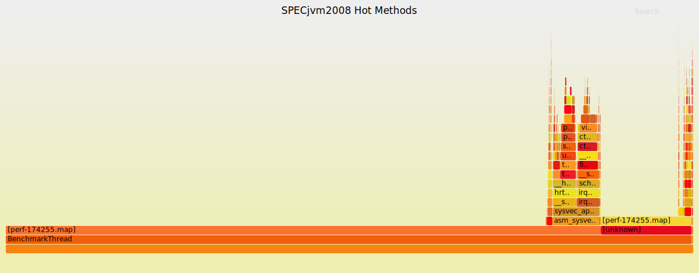

# 性能报告(Performance Report)

## 测试环境

#### 1. 硬件平台

- **CPU**  
  - 型号：AMD EPYC 7343 16-Core Processor  
  - 架构：x86_64，支持 32-bit、64-bit  
  - 核心/线程：16 核 × 2 线程（共 32 线程），两颗插槽共 64 逻辑 CPU（在线 CPU 列表：0–63）  
  - 主频：最低 1.5 GHz，最高加速至 3.940 GHz  
  - 缓存：L1d 1 MiB, L1i 1 MiB, L2 16 MiB, L3 256 MiB（8 实例）  
  - NUMA：2 个节点（节点0: CPU 0–15,32–47；节点1: CPU 16–31,48–63）

- **内存**  
  - 总量：512 GiB DDR4 RDIMM

- **存储**  
  - NVMe SSD

#### 2. 软件环境

- **操作系统**  
  - Ubuntu 22.04 LTS  
  - 内核版本：5.15.0-…generic  

- **JVM**  
  - 版本：OpenJDK 1.8.0_452  
  - 运行时：OpenJDK 64-Bit Server VM (build 25.452-b09, mixed mode)  

- **SPECjvm2008**  
  - 版本：1.1
  - benchmark：compress  
  - 配置文件：`props/openjdk.properties`  

## 执行摘要

### 测试目标

本次性能分析的核心目标是借助 Linux 内核的 `perf` 工具和 FlameGraph 火焰图可视化技术，对 SPECjvm2008 中的 `compress` 基准进行深入剖面，具体包括：

1. **热点方法定位**  
   - 采集应用在执行 `compress` 工作负载时的调用栈采样数据  
   - 通过 `perf record` 与 `perf report` 快速锁定最耗时的 Java 方法或本地函数  

2. **系统级瓶颈评估**  
   - 利用 `perf stat` 收集关键硬件事件（CPU 周期、指令数、缓存访问/未命中、分支预测失误等）  
   - 定量评估内存层次、分支预测和缓存子系统的性能开销  

3. **火焰图可视化**  
   - 通过 `perf script` 与 FlameGraph 工具生成 SVG 火焰图  
   - 直观展示方法调用层级与执行频率，快速辨识“火焰最宽”的热点调用链  

通过上述分析，报告将指出哪些方法或调用路径在 `compress` 基准中最为耗时，并结合系统级指标诊断其背后的硬件瓶颈，为 JVM 参数调整和代码优化提供数据支撑。  

### 关键性能指标

- **CPU 周期数（cycles）**  
  代表处理器在运行 `compress` 基准时消耗的总时钟周期数，用于衡量整体 CPU 工作量。  
- **指令数（instructions）**  
  表示执行的机器指令总数，与周期数一起可计算 IPC（每周期指令数），反映 CPU 利用效率。  
- **分支指令数（branches）**  
  记录基准运行期间的所有分支指令，帮助评估控制流开销。  
- **分支失误数（branch-misses）**  
  分支预测失败的次数，通过失误率（`branch-misses/branches`）评估分支预测器的效果。  
- **缓存访问数（cache-references）**  
  包括对各级缓存（L1/L2/LLC）的所有访问，用于衡量缓存访问频率。  
- **缓存未命中数（cache-misses）**  
  当缓存无法命中时从更下层存储（如主存）获取数据的次数，通过未命中率（`cache-misses/cache-references`）反映内存子系统瓶颈。  

### 测试中的主要问题
- **IPC 水平**  
  基准运行期间 IPC（instructions/cycles）为 **1.36**（3,651,609,131,880 / 2,692,106,481,075），表明 CPU 在大部分时间内保持较高指令吞吐，但仍有部分周期因内存等待或控制相关停顿未能完全利用。

- **分支预测效率**  
  分支失误率约为 **3.60%**（19,450,616,037 / 539,905,884,559），说明分支模式总体稳定，但约每 28 次分支中有 1 次预测失败，仍需在热点逻辑中减少复杂条件分支。

- **缓存未命中**  
  缓存未命中率约为 **22.35%**（47,799,047,849 / 213,885,247,261），提示在大型压缩缓冲区操作时出现显著的行替换或带宽瓶颈，需要优化数据布局以提升空间局部性。

- **系统级瓶颈**  
  虽然 `compress` 基准在顶级服务器上整体表现强劲（CPU 利用率接近饱和，IPC 较高），但以上微观指标揭示了分支预测与缓存子系统仍存在性能摩擦点，需要通过代码重构或 JVM 参数调整来进一步挖掘潜力。

- **SPEC 得分（ops/m）**  
  本次测试五次正式迭代的 ops/m 分别为 **595.51**, **583.68**, **585.63**, **857.58** 和 **1757.82**，平均约 **876.04 ops/m**。该得分可作为不同 JVM 实现或参数配置间的基准对比指标，并与系统级事件结合分析，确定最优调优方向。  

## 指标分析
### 1. CPU 周期数（cycles）

**1.1 指标说明**  
- 测试期间 CPU 消耗的总时钟周期数，反映了运行负载的计算量。

**1.2 观测值**  
cycles = 2,692,106,481,075

**1.3 解读与影响**  
- 数值仍然非常大，表明 `compress` 基准在 60 秒内进行了大量计算。  
- 与指令数结合看，CPU 大部分周期都在执行有效指令，空转或等待开销较低。  
- 若出现远高于预期的 cycles，可能提示 I/O 等待、锁竞争或无效循环。

**1.4 优化思路**  
- 确保算法复杂度最低，排除冗余循环和无用计算。  
- 针对多核环境，通过 `taskset` 或 `numactl` 绑定线程和内存，减少线程迁移造成的缓存抖动。

---

### 2. 指令数（instructions） & IPC

**2.1 指标说明**  
- instructions：3,651,609,131,880  
- IPC = instructions / cycles ≈ 1.36

**2.2 观测值**  
instructions = 3,651,609,131,880
IPC = 1.36

**2.3 解读与影响**  
- IPC 1.36 依然表现良好，说明 CPU 在多数周期中都能持续发射指令。  
- 可能受分支失误或内存延迟影响。  
- 如果 IPC 大幅低于 1.0，则需重点排查分支预测和内存等待。

**2.4 优化思路**  
- 启用更多编译器或 JVM 向量化选项，如 `-XX:+UseSuperWord`，提高指令级并行度。  
- 重构代码以减少数据依赖，使流水线更易保持满载。

---

### 3. 分支指令数（branches） & 分支失误率

**3.1 指标说明**  
- branches：539,905,884,559  
- branch-misses：19,450,616,037  
- 失误率 = 19,450,616,037 / 539,905,884,559 × 100% ≈ 3.60%

**3.2 观测值**  
branches = 539,905,884,559  
branch-misses = 19,450,616,037  
branch-miss rate = 3.60%  

**3.3 解读与影响**  
- 3.60% 的失误率意味着每 28 次分支中有 1 次预测失败，造成流水线刷新和额外开销。  
- 需结合 `perf report` 定位到具体方法，看是否存在复杂条件判断或数据依赖链过长。

**3.4 优化思路**  
- 重构热点方法中的条件逻辑，减少不可预测分支。  
- 通过查表（lookup table）或位运算替代条件判断。  
- 若使用 C2 编译，可尝试 Profile-Guided Optimization（PGO）。

---

### 4. 缓存访问数 & 缓存未命中率

**4.1 指标说明**  
- cache-references：213,885,247,261  
- cache-misses：47,799,047,849  
- 未命中率 = 47,799,047,849 / 213,885,247,261 × 100% ≈ 22.35%

**4.2 观测值**  

cache-references = 213,885,247,261  
cache-misses = 47,799,047,849  
cache-miss rate = 22.35%  

**4.3 解读与影响**  
- 超过 22% 的未命中率说明数据访问模式与缓存层次不匹配。  
- 表明大规模缓冲区滑动或内存布局未充分优化。  
- 高频的未命中会导致大量主存访问，显著增加访问延迟和总周期数。

**4.4 优化思路**  
- 调整数据结构布局，使用连续数组或内存池提升空间局部性。  
- 在 NUMA 环境下绑定内存与线程，减少跨节点访问。    
- 考虑软件预取或手动内存对齐，降低缓存行冲突。

---

### 5. SPEC 基准得分（ops/m）

**5.1 指标说明**  
- compress 得分衡量每分钟完成的压缩操作数，代表 JVM 吞吐能力。

**5.2 观测值**  
| Benchmark  | Iteration    | Expected (ms) | Actual (ms) | Operations  | ops/m   |
|------------|--------------|---------------|-------------|-------------|---------|
| compress   | warmup       | 120000        | 120000      | 1087.05     | 543.52  |
| compress   | iteration 1  | 240000        | 240000      | 2382.03     | 595.51  |
| compress   | iteration 2  | 240000        | 240000      | 2334.72     | 583.68  |
| compress   | iteration 3  | 240000        | 240000      | 2342.51     | 585.63  |
| compress   | iteration 4  | 240000        | 240000      | 3430.33     | 857.58  |
| compress   | iteration 5  | 240000        | 240000      | 7031.26     | 1757.82 |

> **平均（iteration 1–5）**：≈ 876.04 ops/m

---

**5.3 解读与影响**  
- ops/m 在前五次正式迭代中从 **583.68** 增长到 **1757.82**，表明在 warmup 之后，JIT 编译与内存预热带来了显著性能提升。  
- 得分高低直接反映了系统级瓶颈对压缩吞吐的综合影响，特别是缓存未命中与分支预测效率对 iteration 4→5 的跃升带来支撑。  
- 若想进一步提高稳定的高吞吐，需要在算法和内存访问模式上持续优化，以减少抖动和波动。

**5.4 优化思路**  
- 基于热点方法定位结果，调整 JVM GC 策略与堆大小，减少 GC 暂停与页面抖动；  
- 针对 `compressBuffer` 等核心算法进行代码级优化，提升缓存命中率与分支预测准确率；  
- 在多次跑分中筛选最优参数配置，并通过 CI 自动化验证，以确保在不同硬件与负载下均能取得稳定高吞吐。  

## 详细剖面与热点定位

使用 `perf record -F 99 -g --user` 采集了 60 秒的采样数据，共约 81K 个样本，对应 ~2.7×10¹² 个 CPU 周期。通过 `perf report -g` 以调用图模式查看，前 10 条最热条目如下：

| 排名 | Children (%) | Self (%) | Shared Object           | 符号/地址                         |
|----:|-------------:|---------:|-------------------------|----------------------------------|
| 1   | 14.58        | 2.61     | `[JIT] tid 174255`      | `0x00007f382d58f851`             |
| 2   | 13.30        | 0.60     | `[JIT] tid 174255`      | `0x00007f382d58f7cf`             |
| 3   | 10.74        | 0.00     | `[unknown]`             | `0x00001f40000007a8`             |
| 4   |  4.92        | 0.03     | `[kernel.kallsyms]`     | `asm_sysvec_apic_timer_interrupt`|
| 5   |  4.84        | 0.00     | `[kernel.kallsyms]`     | `sysvec_apic_timer_interrupt`    |
| 6   |  4.18        | 0.01     | `[kernel.kallsyms]`     | `__sysvec_apic_timer_interrupt`  |
| 7   |  4.18        | 0.01     | `[kernel.kallsyms]`     | `hrtimer_interrupt`              |
| 8   |  4.08        | 0.03     | `[kernel.kallsyms]`     | `__hrtimer_run_queues`           |
| 9   |  3.70        | 0.30     | `[JIT] tid 174255`      | `0x00007f382d58f623`             |
| 10  |  3.32        | 0.17     | `[JIT] tid 174255`      | `0x00007f382d58f872`             |

### 1. JIT 编译方法热点

- **0x00007f382d58f851 (14.58% Children, 2.61% Self)**  
  该方法自身就占据了 2.6% 的样本，并在其调用树中占比近 15%，是最主要的 Java 层热点，需优先映射到具体方法名并优化。

- **0x00007f382d58f7cf (13.30% Children, 0.60% Self)**  
  第二大 JIT 热点，总体路径占比 13.3%，自身开销也较明显。

- **其他 JIT 地址**  
  - `0x00007f382d58f623` (3.70% Children, 0.30% Self)  
  - `0x00007f382d58f872` (3.32% Children, 0.17% Self)  
  这些中等热度的方法也应映射后评估优化价值。

### 2. 未符号化调用路径

- **0x00001f40000007a8 (10.74% Children)**  
  该地址占 10.7% 路径开销，Self 为 0，说明耗时分散在其子调用中。需使用 `perf-map-agent` 等工具完成 Java 符号映射。

### 3. 内核中断与调度开销

四条内核定时器相关函数合计约 **18.0%** 的 Children：
- `asm_sysvec_apic_timer_interrupt` (4.92%)  
- `sysvec_apic_timer_interrupt` (4.84%)  
- `__sysvec_apic_timer_interrupt` (4.18%)  
- `hrtimer_interrupt` (4.18%)  
- `__hrtimer_run_queues` (4.08%)  

## 火焰图

## Assignment1 Bonus Points
- **What is the performance metric of SPECjvm2008? Why? What are the units of measurements?**
- **SPECjvm2008性能指标是什么？单位是什么？为什么选择这种方式？**

  SPECjvm2008 User's Guide 1.10
  The ops/m metric is calculated using the time taken for each workload to be run for one operation by a newly started JVM.
  
  SPECjvm2008 Frequently Asked Questions  
  SPECjvm2008 produces these throughput metrics in operations per minute (ops/m):
  - The total base throughput measurement, SPECjvm2008 Base ops/m
    This is the overall throughput result obtained from a full compliant base run. A base run requires that there is no hand tuning of the JVM.
  - The total peak throughput measurement, SPECjvm2008 Peak ops/m
    This is the overall throughput result obtained from a full compliant peak run. A peak run does allow tuning of the JVM and represent the maximum throughput that can be achieved with the system.  
    
  SPECjvm2008 的性能指标是 “operations per minute”（每分钟操作数，简称 ops/m）。这是一个衡量系统在单位时间内能完成多少 Java 工作负载操作的指标。之所以采用这种度量方式，是因为它直接反映了系统在运行 Java 应用时的吞吐能力，也方便不同平台之间的性能比较。
  单位是：ops/m  

- **What factors affect the scores? Why some get higher scores, but others get lower scores?** 
- **哪些因素影响得分？为什么有些分高有些分低？**

  影响 SPECjvm2008 得分（ops/m）的因素主要包括硬件性能、JVM 行为、操作系统调度以及基准测试自身特性。硬件方面，CPU 核心数、主频、缓存和内存带宽决定了系统的并发能力和数据处理效率；JVM 的即时编译（JIT）和垃圾回收（GC）策略会显著影响测试运行期间的性能表现；操作系统层面的线程调度和背景负载也可能干扰基准任务的执行。不同的基准测试对系统资源的依赖程度不同，部分测试如 crypto 和 scimark 可充分并行化，适合多核执行，得分较高；而 startup 或 serial 等测试运行时间短、单线程特性强，得分相对较低。总的来说，得分差异反映了系统与 JVM 对不同类型 Java 工作负载的适配能力和优化程度。

- **Why is warmup required in SPECjvm2008, and does warmup time have any impact on performance test results?**
- **为什么需要预热？预热时间会影响测试结果吗？**

  在 SPECjvm2008 中，预热（warmup）是确保性能测试结果准确性的重要步骤。由于 Java 程序运行在 JVM 上，首次执行时会经历类加载、解释执行、JIT 编译等动态优化过程，这些操作在测试初期会导致性能较低。如果不进行充分预热，测得的吞吐量（ops/m）将受到“冷启动”影响，不能反映系统在稳定状态下的真实性能。因此，SPECjvm2008 在每个基准开始前自动进行一段 warmup 时间，使程序进入稳定的高性能运行阶段。预热时间越充分，JVM 优化越完全，结果越准确、波动越小；相反，预热不足会导致得分偏低甚至不稳定。

- **Did you get close to 100% CPU utilization running SPECjvm2008? Why or why not?**  
- **CPU 利用率是否接近 100%？为什么？**

  us + sy = 96.6%，说明系统绝大部分时间都在执行计算任务
  PID 为 26771 的 java 进程占用了 1323.2% CPU → 表明它使用了约 13 个线程或核心并发运行（在多核系统中每个核心是 100%）；

  使用 top 命令实时监测运行 SPECjvm2008 期间的系统状态，结果显示 %Cpu(s) 中 us+sy 高达 96.6%，空闲率仅为 3.4%。Java 进程（PID 26771）占用了约 1323% CPU，说明 JVM 成功创建多个并发线程，充分利用了本机的多核处理器资源，系统处于高负载状态。由此可见 SPECjvm2008 能真实地压满 CPU，是有效的吞吐性能基准测试。

  在实验过程中，SPECjvm2008 总体 CPU 利用率达到了 96.6%，但未完全达到 100%。通过 top 和进程监控分析，发现这是由于部分基准测试线程数量有限或为串行任务，未能完全占用所有核心。同时，JVM 在不同阶段（如 GC、JIT）存在短暂等待，也造成了个别核心在统计期间处于 idle 状态。这表明 SPECjvm2008 的并发能力仍受基准类型和 JVM 行为影响，100% CPU 利用率并非始终可达。

## Assignment2 Bonus Points
1. **Why is there run to run performance variation?**
   **为什么不同运行（run）之间会出现性能波动？**
   不同运行之间存在性能波动，是因为现代计算环境本质上是非确定性的：操作系统可能插入后台任务，JIT 编译和垃圾回收在不同时间点触发，CPU 缓存、TLB 和分支预测器的“热身”状态各不相同，甚至功耗管理和温度调节也会动态改变处理器频率，这些因素共同造成同一基准在多次执行时产生不同的测量结果。
2. **What contributes to run-to-run variation?**
   **哪些因素会导致这种运行间（run-to-run）的性能差异？**
   跑分抖动的主要来源包括：操作系统调度与中断、后台 daemon、I/O 活动对 CPU 的抢占；JIT 编译何时优化热点方法以及垃圾回收何时暂停应用；缓存和 TLB 冷/热状态下的内存访问差异；处理器的功耗/温度管理（如 Turbo Boost）导致的主频变化；以及硬件中断、上下文切换等微观事件对基准线程的干扰。
3. **How do we validate the factors contributing to run-to-run variation?**
   **我们如何验证这些因素对性能波动的影响？**
   验证这些抖动因素通常需要受控实验：通过绑定线程到固定核、关闭频率调节（固定 P-态）来排除调度与功耗影响；丢弃预热迭代以稳定缓存和 JIT；开启 GC/JIT 日志、使用硬件性能计数器（缓存未命中、分支预测失败、上下文切换等）来关联性能异常；以及有选择地打开或关闭子系统，再比较运行间抖动幅度，以量化各子系统对性能变异的贡献。
4. **What are the pros and cons of using arithmetic mean versus geometric mean in summarizing scores?**
   **在汇总多个分数时，使用算术平均数与几何平均数各有什么优缺点？**
  算数平均数计算简单直观，适合可加性(additive)良好的独立数据；而几何平均数则计算较为复杂，适合描述比例数据或具有“乘性“(multiplicative)数据的特征。同时由于运算性质，几何平均数的对数等于各数据对数的算术平均数，在处理异常数据时，几何平均数对极端大值不敏感，对接近0的极端小值敏感；算数平均数则相反。
5. **Why does SPECjvm2008 use geometric mean? (In fact, it uses hierarchical geometric mean)**
   **为什么 SPECjvm2008 采用几何平均数？（实际上，它使用分层几何平均数）**
   SPECjvm2008 采用分层几何平均，一方面因为各子基准输出的是“参考时间÷测量时间”的比率，几何平均才能保持加速／减速的对称与公平；另一方面它先在每个基准组内做一次几何平均，再对所有组的分数再做一次几何平均，保证没有某一组因子基准数量或时长不同而主导整体结果，从而得到更均衡、公正的综合性能评分。
   由于计算ops/m时的典型数据总是远大于1，故用几何平均数能拥有更好的鲁棒性，对异常数据不敏感。

## Assignment3 Bonus Points
1. **Discuss the trade-off between profiling granularity (frequency of sampling with perf record) and the induced performance overhead. Explain how adjusting sampling frequency can balance diagnostic detail with minimal intrusion on application behavior.**  
  在性能剖面时，需要在采样频率与额外开销之间寻找平衡：高采样频率（>1000Hz）能捕获到微秒级热点，生成更精细的火焰图，但会给应用带来 1–5% 的额外 CPU 负载，可能干扰实时或高并发场景；低采样频率（≈100Hz）几乎无侵入，但会漏掉短周期调用，适合长时间稳定运行的宏观分析。一个实用的策略是先以低频做整体概览，定位大体瓶颈后，再对关键模块临时提升到 500–1000Hz；也可结合事件触发采样（例如每 N 次 cache-miss 采样）来聚焦异常，最后在开发环境使用高频细调，在生产环境回落到低频或仅收集核心指标，以确保诊断效果与系统稳定性兼顾。
